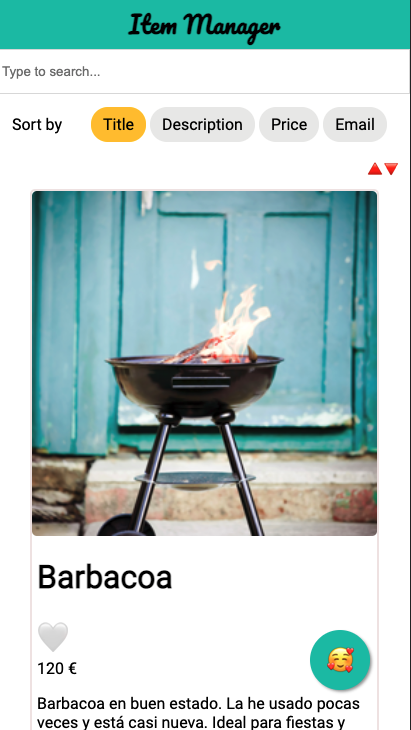

# Item Manager

The goal was to create a small APP that fetches an API endpoint and shows the items in a result page.

## Features

- Fully responsive layout following the mobile first principle
- Dynamic item list using fetched data from an external JSON-API
- Lazy-loading of product images
- Infinite scroll that shows items in batches of 5 when scrolling
- Searchbar that allows dynamic filtering of products based on Title, Description, Price, Email
- Sorting functionality (Title, Description, Price, Email)
- Ordering functionality (ascending, descending)
- Marking items as favorite
- Floating button that triggers a modal showing favorite items
- Searchbar inside favorite modal

## Getting Started

### Required Node- & NPM-Versions

Please note that the app was developed using Node @12.16.1 and npm @6.14.5.

### Install Dependencies

First, install all dependencies by running the CLI-command

#### `npm install`

### Development

You can run a local development server with

#### `npm start`

Open [http://localhost:1234](http://localhost:1234) to view the app in the browser.

### Build & Deploy

You can build out the static (bundled) files for the app by running

#### `npm run build`

### Running Tests

#### e2e tests

End to end tests can be run using

#### `npm run test:e2e`

#### All tests

All tests can be run using

#### `npm run test`

## Considerations

- The project was scaffolded using the beta 2 version of Parcel. I used this boilerplate for its unmatched speed and zero configuration feature.
- I decide to use TypeScript as it has no implications on the genereated bundle-size (as its compiled during the build) and makes the code much more secure because of the static typing, adding an additional layer of test along with unit test and e2e test.
- I tried to not rely on external dependencies besides React library and a small React component installed through npm.
- I thought of using styled components for styling my app as it is a standard right now throughout React community, but I finally went for SaSS preprocessor as it was a nice have in the requirements :)
- My goal was to build a minimalistic and easy-to-use UI.
- When building the architecture I first went for classic props/state approach, but as the app was growing I decided to keep all the state management into Context API and hydrate the functional components with the required states. I did this in app.tsx and items.tsx where all the app logic, not views related, is kept. For a bigger application I would probably went for some kind of state management library such of Redux, but for this case I thought it was a bit overkill and it would add much more complexity to the app.
- I decided to do e2e test along with unit tests for most relevant components. I did this, using Jest with React Testing Library. In the future I would absolutely went for integrating some library such as Puppeteer in order to interact with the browser and test even deeper.
